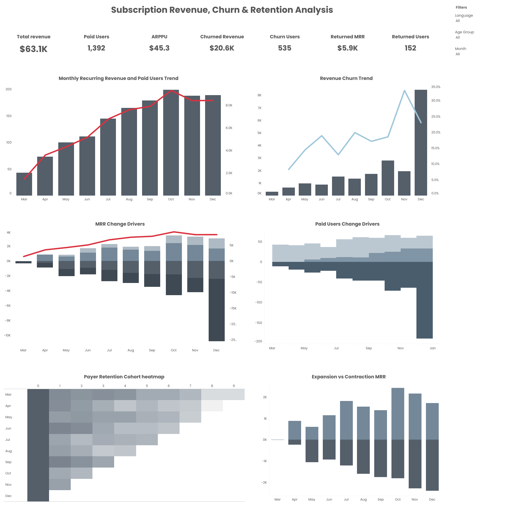

# Subscription Revenue, Churn & Retention Analysis

An end-to-end data analytics project focused on subscription revenue performance and customer lifecycle behaviour. The project combines SQL-based data preparation with an interactive Tableau dashboard for monitoring recurring revenue, user acquisition, churn, reactivation, and revenue movement.

## Live Dashboard

[View the interactive Tableau dashboard](https://public.tableau.com/views/RakN_DA32_FP2/Dashboard1?:language=en-US&:sid=&:redirect=auth&:display_count=n&:origin=viz_share_link)



## Project Objective

The objective of this project is to transform raw payment and user data into a structured monthly analytical dataset and provide a clear view of subscription business performance.

The analysis supports the following business questions:

- How does monthly recurring revenue change over time?
- How many users are new, active, returning, or churned?
- How much revenue is generated by new and reactivated users?
- How much recurring revenue is lost through churn and contraction?
- How much additional revenue is generated through account expansion?
- How do user characteristics such as age, language, and device type relate to revenue behaviour?

## Key Metrics

- Monthly Recurring Revenue (MRR)
- Paid Users
- Average Revenue per Paying User (ARPPU)
- New Paid Users
- New MRR
- Returned Users and Returned MRR
- Churned Users and Churned Revenue
- Expansion MRR
- Contraction MRR

## Tools and Technologies

- PostgreSQL
- SQL window functions: `LAG()` and `LEAD()`
- Common Table Expressions (CTEs)
- Tableau Public
- Data cleaning and deduplication
- Monthly cohort and customer lifecycle analysis

## Analytical Workflow

1. Removed duplicate payment records.
2. Aggregated user revenue by month.
3. Used window functions to compare each user’s current, previous, and next payment months.
4. Classified users as new, returning, active, or churned.
5. Calculated revenue movements, including new, returned, expansion, contraction, and churned MRR.
6. Added user attributes such as language, age, and older-device status.
7. Connected the prepared dataset to Tableau and built the interactive dashboard.

## Repository Structure

```text
subscription-revenue-churn-retention-analysis/
├── README.md
├── sql/
│   └── subscription_revenue_metrics.sql
└── images/
    └── dashboard-preview.png
```

## SQL Logic

The SQL query creates a user-level monthly revenue dataset and calculates subscription lifecycle indicators. The main logic includes:

- deduplication of payment transactions;
- monthly revenue aggregation by user;
- identification of previous and next payment periods;
- detection of new, returned, and churned users;
- calculation of expansion and contraction revenue;
- enrichment with user demographic and device attributes.

The complete query is available here:

[`sql/subscription_revenue_metrics.sql`](subscription-revenue-metrics.sql)

## Dashboard Features

The Tableau dashboard provides an interactive view of subscription performance and allows users to explore revenue and customer metrics over time and across user segments.

## Author

**Nataliia Rak**  
Data Analyst  
[Tableau Public Profile](https://public.tableau.com/app/profile/nataliia.rak/vizzes)
